# Diagrama Entidad-Relación — FairBet Lab

```mermaid
erDiagram
    User ||--o{ Cuenta : tiene
    User ||--|| PerfilUsuario : posee
    User ||--o{ Apuesta : realiza
    User ||--o{ AutoExclusion : solicita
    User ||--o{ LimiteDeposito : configura
    User ||--o{ SuspiciousActivity : genera

    Cuenta ||--o{ AsientoContable : registra
    AsientoContable }o--|| TipoAsiento : clasifica

    Evento ||--o{ Mercado : contiene
    Mercado ||--o{ Cuota : tiene
    Cuota ||--o{ HistorialCuota : guarda_historial
    Cuota ||--o{ PiernaApuesta : referenciada_en

    Apuesta ||--o{ PiernaApuesta : compone

    PerfilUsuario {
        uuid id PK
        uuid usuario_id FK "OneToOne → User"
        string dni "unique, 8 dígitos"
        date fecha_nacimiento
        enum estado_kyc "pendiente | verificado | bloqueado"
        datetime fecha_verificacion_kyc
        string telefono
        datetime fecha_creacion
    }

    Cuenta {
        uuid id PK
        uuid usuario_id FK "nullable — null = sistema"
        enum tipo_cuenta "billetera_usuario | casa | apuestas_pendientes | bonos"
        string moneda "default: FIC"
        datetime fecha_creacion
    }

    AsientoContable {
        uuid id PK
        uuid cuenta_id FK
        decimal monto "max_digits=18, decimal_places=4"
        enum direccion "DEBITO | CREDITO"
        uuid id_transaccion "db_index"
        enum tipo_asiento "recarga | retiro | transferencia | bloqueo_apuesta | ganancia_apuesta | perdida_apuesta | cash_out | bono_acreditado | bono_debitado"
        uuid id_referencia "nullable"
        string notas
        datetime fecha_creacion "db_index, inmutable"
    }

    Evento {
        uuid id PK
        string nombre
        string deporte "default: futbol"
        string equipo_local
        string equipo_visitante
        datetime inicia_en
        enum estado "programado | en_vivo | finalizado | suspendido | anulado"
        json resultado "nullable"
        boolean es_momento_critico
        datetime momento_critico_desde "nullable"
        datetime ultimo_cambio_estado
        datetime apuestas_cerradas_en "nullable"
        json desempate_fair_play "nullable"
    }

    Mercado {
        uuid id PK
        uuid evento_id FK
        enum tipo "1x2 | sobre_bajo | ambos_anotan | handicap_asiatico"
        enum estado "abierto | suspendido | cerrado | liquidado"
        datetime suspendido_hasta "nullable"
        enum motivo_suspension "evento_critico | manual | pre_partido | liquidacion"
        enum suspendido_por "SISTEMA | OPERADOR"
        decimal margen_operador "default: 0.05"
    }

    Cuota {
        uuid id PK
        uuid mercado_id FK
        enum seleccion "local | empate | visitante | sobre | bajo | si | no"
        decimal valor "max_digits=10, decimal_places=4"
        boolean activa "default: true"
        boolean es_ganadora "nullable, default: null"
        datetime liquidada_en "nullable"
        datetime actualizada_en "auto_now"
    }

    HistorialCuota {
        uuid id PK
        uuid cuota_id FK
        decimal valor
        datetime registrado_en "auto_now_add"
    }

    Apuesta {
        uuid id PK
        uuid usuario_id FK
        enum tipo "simple | combinada"
        enum estado "pendiente | aceptada | ganada | perdida | cash_out | cancelada"
        decimal monto_apostado "max_digits=18, decimal_places=4"
        decimal cuota_total
        decimal ganancia_potencial
        decimal ganancia_real "nullable"
        decimal monto_cash_out "nullable"
        datetime fecha_creacion
        datetime fecha_aceptacion "nullable"
        datetime fecha_liquidacion "nullable"
        string clave_idempotencia "unique, db_index"
        boolean verificacion_juego_responsable
    }

    PiernaApuesta {
        uuid id PK
        uuid apuesta_id FK "CASCADE"
        uuid cuota_id FK
        decimal cuota_al_momento
        boolean es_ganadora "nullable"
    }

    AutoExclusion {
        uuid id PK
        uuid usuario_id FK
        enum tipo "temporal_7 | temporal_30 | temporal_90 | indefinida"
        datetime fecha_inicio
        datetime fecha_fin "nullable — null = indefinida"
        boolean activa "default: true"
        datetime fecha_creacion
    }

    LimiteDeposito {
        uuid id PK
        uuid usuario_id FK
        enum periodo "diario | semanal | mensual"
        decimal monto
        decimal monto_pendiente "nullable"
        datetime pendiente_desde "nullable"
        datetime pendiente_aplicable_desde "nullable"
        datetime enfriamiento_hasta "nullable"
        datetime fecha_actualizacion "auto_now"
    }

    SuspiciousActivity {
        uuid id PK
        uuid usuario_id FK "nullable"
        string regla
        text descripcion
        string ip_address "nullable"
        json metadata
        enum estado "pendiente | revisado | descartado"
        datetime fecha_creacion
    }
```

## Convenciones

- Todas las tablas usan `UUID` como primary key.
- Todas las FK usan `on_delete=PROTECT` excepto `PiernaApuesta → Apuesta` que es `CASCADE`.
- `User` es el modelo `auth.User` de Django (no se muestra con campos aquí).
- `Cuenta.usuario` es nullable para cuentas del sistema (casa, pendientes, bonos).
- `AsientoContable` es inmutable: no se puede modificar ni eliminar una vez creado.
