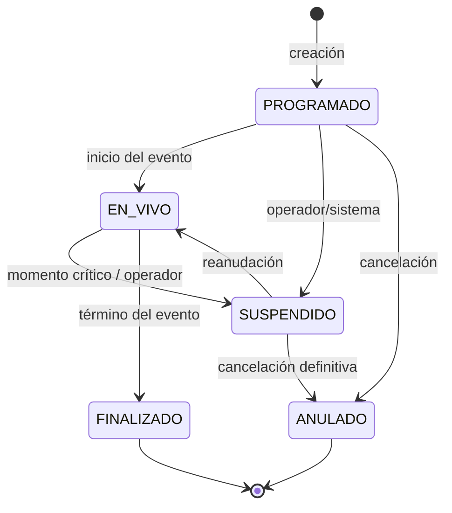
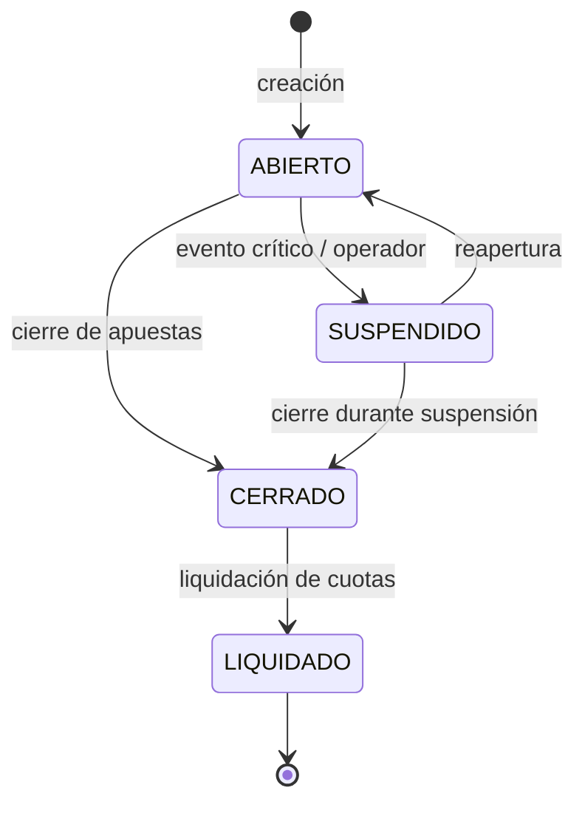
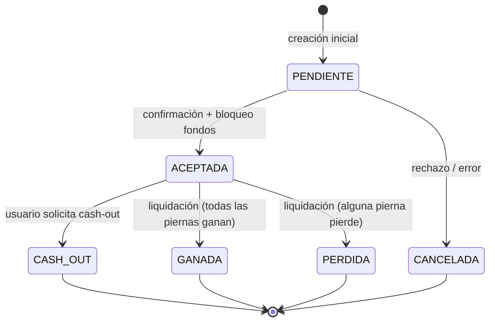
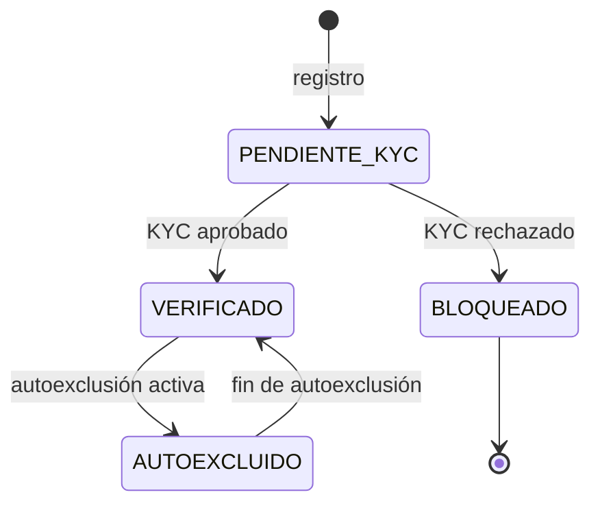
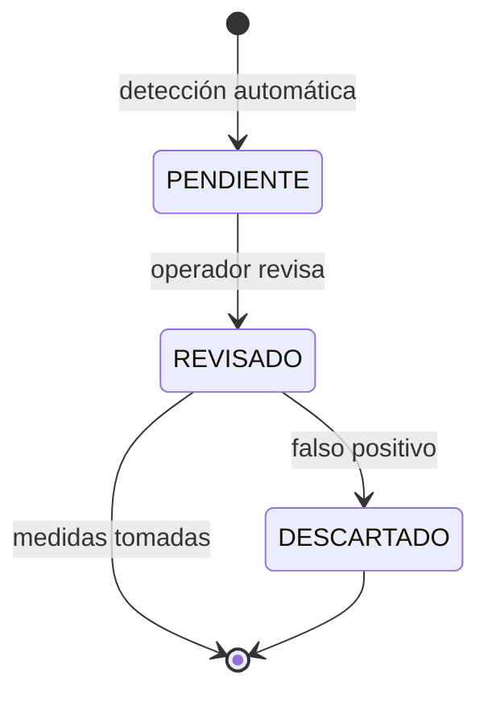

# Máquinas de Estado — FairBet Lab

## 1. Evento

- **PROGRAMADO**: estado inicial. Apuestas abiertas (pre-partido e in-play).
- **EN_VIVO**: el evento está en curso. Apuestas abiertas (cuotas dinámicas).
- **SUSPENDIDO**: apuestas cerradas temporalmente (gol, tarjeta roja, etc.).
- **FINALIZADO**: apuestas liquidadas, no se aceptan más apuestas.
- **ANULADO**: evento cancelado, apuestas reembolsadas.

## 2. Mercado

- **ABIERTO**: se pueden realizar apuestas.
- **SUSPENDIDO**: apuestas pausadas temporalmente.
- **CERRADO**: no se aceptan más apuestas (el evento comenzó o el operador cerró).
- **LIQUIDADO**: todas las cuotas del mercado tienen resultado asignado.

## 3. Apuesta

- **PENDIENTE**: estado transitorio durante la creación.
- **ACEPTADA**: fondos bloqueados, apuesta activa. Puede ser simple o combinada.
- **GANADA**: el usuario ganó. Payout = `stake × cuota_total`.
- **PERDIDA**: el usuario perdió. Pérdida = `stake` (va a la casa).
- **CASH_OUT**: liquidación anticipada. El usuario recibe un monto calculado.
- **CANCELADA**: apuesta anulada por error del sistema o evento anulado.

## 4. Cuenta de usuario (estado operativo)

- **PENDIENTE_KYC**: puede ver eventos pero no apostar.
- **VERIFICADO**: puede apostar, recargar, retirar.
- **AUTOEXCLUIDO**: no puede apostar ni recargar (solo retirar fondos).
- **BLOQUEADO**: cuenta cerrada por KYC rechazado o decisión del operador.

## 5. Alerta de actividad sospechosa

- **PENDIENTE**: alerta generada, espera revisión del operador.
- **REVISADO**: el operador ya revisó la alerta.
- **DESCARTADO**: se determinó que no era fraude.
